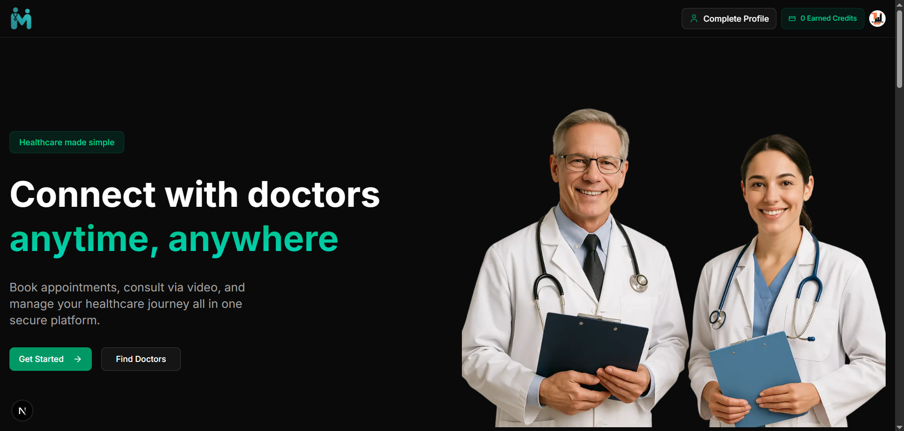
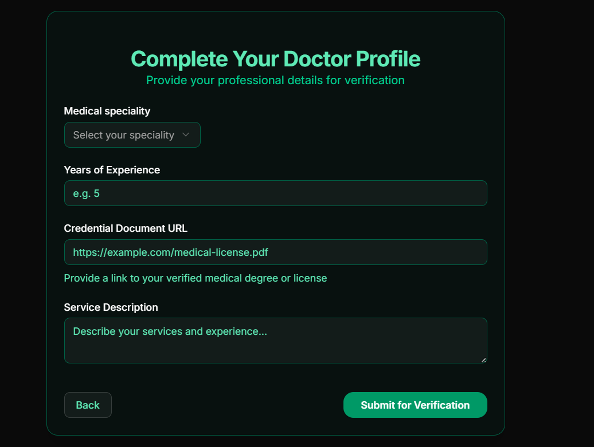
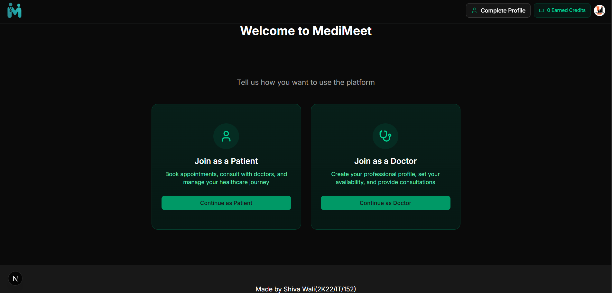
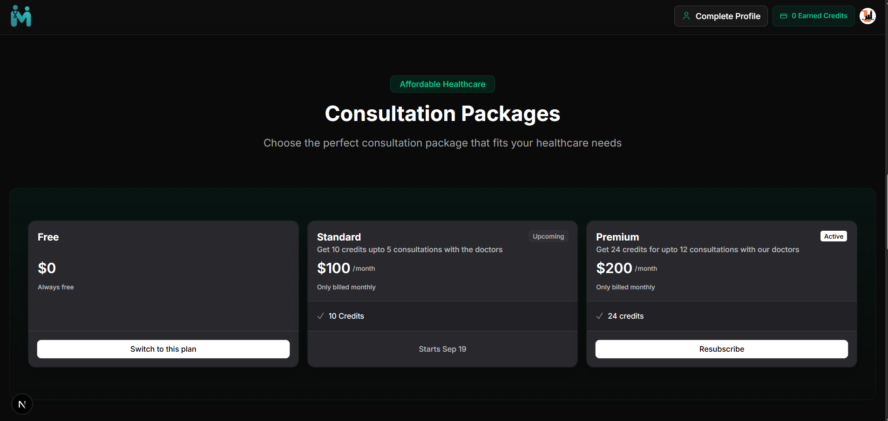
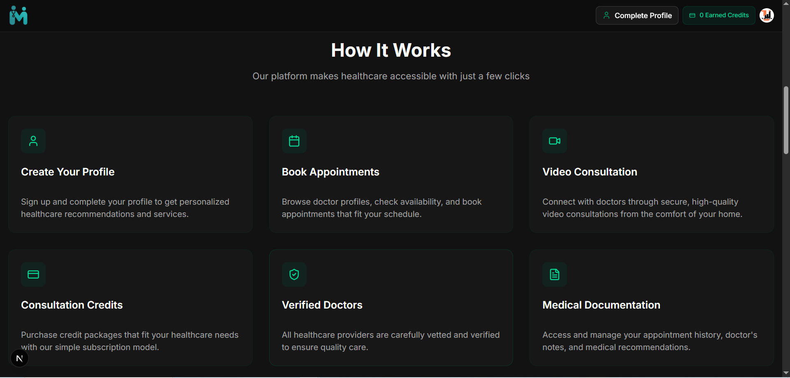

# MediMeet 🏥  
A healthcare appointment booking platform built with **Next.js**, **Prisma**, and **Postgres**.  

✨ Key Features  
- Secure patient & doctor **authentication** with **Clerk**  
- Appointment booking with **concurrency handling** (row-level locking)  
- **User authentication** (Login & Signup) with **Clerk**  
- **Doctor & patient role-based access**  
- **Appointment booking system** with Prisma ORM  
- **UI components** styled using **ShadCN UI + TailwindCSS**  
- **Modern frontend** with Next.js App Router  

🛠 Tech Stack  
- **Frontend:** Next.js, TailwindCSS, ShadCN UI  
- **Backend:** Next.js API Routes, Prisma ORM  
- **Database:** PostgreSQL (Neon)  
- **Authentication:** Clerk  

🚀 Getting Started  

1. Clone the repo  
```bash
git clone https://github.com/Artist393/medimeet.git
cd medimeet

📸 Screenshots  

**Dashboard Page**  
  

**Doctor Verification Page**  
  

**Onboarding Page**  
  

**Subscription Plans Page**  
  

**Working Page**  
  


